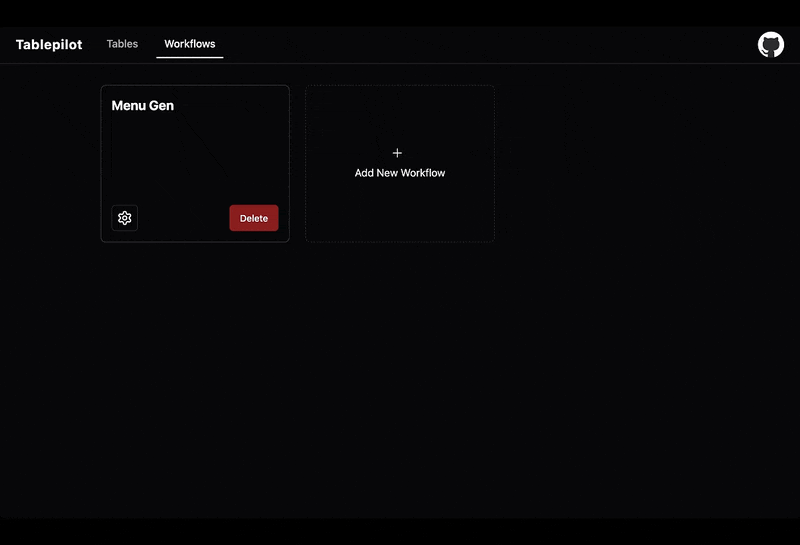

<div align="center">
    
</div>

# Tablepilot

Tablepilot is a simple yet powerful AI-native platform for tabular data generation.

### Key Features

* Easily Generate, Autofill, Regenerate Rows
* Available on CLI, Web UI, App
* Supports Vision, Image Generation, Image Editing
* Create diverse and creative content using customizable sources
* Create Workflows to automate repetitive content generation tasks

### Demos

#### Generate / Autofill / Regenerate Recipes

<div align="start">
    
</div>

---

#### Workflow

A workflow that extracts dishes from a menu image, adds an image column, autofills missing images, and exports the generated data as a CSV file

<div align="start">
    
</div>

---

Tablepilot uses a declarative schema format to create tables. Check out the [examples folder](examples) for many interesting use cases. The syntax is simple and intuitive, you can easily understand how it works without reading the full documentation.

#### Capabilities and Model Requirements

| Mode                         | Description                                                         | Available            | Model Requirements                                                      |
|------------------------------|---------------------------------------------------------------------|----------------------|-------------------------------------------------------------------------|
| builder                      | Create tables interactively using natural language                  | CLI                  | OpenAI Chat Completion API with support for parallel function calls       |
| generate(text)                | Generate rows (text) for the table                                  | CLI, API, WebUI, App      | OpenAI Chat Completion API with support for Structured Output            |
| autofill(text)                | Autofill columns (text) for existing rows in the table              | CLI, API, WebUI, App      | OpenAI Chat Completion API with support for Structured Output            |
| generate(text + vision)     | Generate rows (text) for the table, with image context              | CLI, API, WebUI, App      | OpenAI Chat Completion API with support for Structured Output and Vision |
| autofill(text + vision)     | Autofill columns (text) for existing rows, with image context       | CLI, API, WebUI, App      | OpenAI Chat Completion API with support for Structured Output and Vision |
| generate(text + image generation/edit) | Generate rows (text or image) for the table, with image context | CLI, API, WebUI, App      | The provider type must be `gemini`, and only `gemini-2.0-flash-exp-image-generation/gemini-2.0-flash-exp` is currently supported                     |
| autofill(text + image generation/edit) | Autofill columns (text or image) for existing rows, with image context | CLI, API, WebUI, App | The provider type must be `gemini`, and only `gemini-2.0-flash-exp-image-generation/gemini-2.0-flash-exp` is currently supported                       |
| image to table     | Extract structured data from an image into a table              | CLI, API, WebUI, App      | OpenAI Chat Completion API with support for Structured Output and Vision |
| workflow                      | Automate multi-step content generation tasks                  | CLI, API, WebUI, App                  | Depend on the steps of the workflow       |

> OpenAI Chat Completion API refers to any API compatible with OpenAI, such as Gemini, vLLM, Ollama, and xAI.

#### Download Binary Release

Pre-built binaries for various operating systems are available on the [Releases](https://github.com/Yiling-J/tablepilot/releases) page.

* Files with the `tablepilot_cli` prefix are for command-line interface (CLI) use. These include the CLI itself, as well as the API and WebUI.
* To use the Tablepilot desktop app on macOS or Windows, download the file with the `tablepilot_app` prefix that matches your platform (`.dmg` for macOS, `.exe` or `.msi` for Windows).

#### Install with Go
Ensure that Go is installed on your system. Then run `go install github.com/Yiling-J/tablepilot@latest`. Only **CLI and API** are supported.

#### Install from Source
Ensure that Go is installed on your system. Then, clone the repository and run `make install`. After installation, the `tablepilot` command should be available for use. This includes **CLI and API**. To use the WebUI, you need to **build the frontend first, before running make install**. Ensure you have `pnpm`, `tsc` and `node` installed, then run `make build-ui`, Once built, you can start the server using `serve` command.

To build the Desktop App, you'll need everything required for the WebUI, plus Rust and Tauri. Once set up, run  `make tauri-dev`, this will build and launch the Tauri app in development mode.

#### CLI and API Documentation

Tablepilot provides a full set of CLI commands, including `builder`, `create`, `update`, `autofill` and many more. Most CLI commands have corresponding API endpoints, and most operations can also be performed through the WebUI or App. Use `tablepilot serve` command to start API server and WebUI.

- For a complete list of CLI commands, see [this doc](CLI.md).
- For all available API endpoints, see [this doc](API.md).
- For workflow schema and CLI, see [this doc](Workflow.md).

## Guide

If you're using Tablepilot in CLI or WebUI mode, the first step is to prepare a TOML config file. Below is an example `config.toml` file using an SQLite3 database (`data.db`) and use `gemini-2.0-flash-001`. Make sure to replace the `key` field with your actual Gemini API key before saving the file as `config.toml`.

```toml
[database]
driver = "sqlite3"
dsn = "data.db?_pragma=foreign_keys(1)"

[[providers]]
name = "gemini"
type = "Gemini"
key = "your_api_key"

[[models]]
model = "gemini-2.0-flash-001"
provider = "gemini"
rpm = 20
```

> For more config details, check the [documentation](docs/config).

If you're using the Tablepilot desktop app, you **do not need a config file** to get started. Providers and models can be added dynamically through the UI, and the database file will be created automatically in the app's data directory.

Tablepilot has two modes: generate and autofill. Use generate mode when you want to create new rows from scratch. Use autofill mode when you already have a table with data, and you’ve added new columns that needs to be filled in. Before diving into these two modes, let’s go over a few basic concepts.

In Tablepilot, tables are defined using a JSON schema. You pass this JSON file via CLI, send it as a payload via API, or create it through the WebUI (which auto-generates the JSON under the hood). The schema format looks like this:
```json
{
  "name": "{name of the table}",
  "description": "{description of the table}",
  "sources": [source objects],
  "columns": [column objects]
}
```
Let’s briefly review what each part means. Full definitions are available [here](docs/schema).

### Sources

> See the [source config readme](docs/schema/source.md) for full details.

When generating a row, non-AI columns are filled first using data from **source**. These values are then passed as context to the LLM to generate the remaining columns.

Sources are the core of Tablepilot's flexibility and support 6 types:

- list
- ai
- files
- linked
- csv
- parquet

The first three act like lists of options. For example, a fruits list `["apple", "banana", "orange"]` and each row picks one value from it.

- **list**: Options are predefined by you.
- **ai**: If you don’t know the options, you can prompt the LLM to generate them.
- **files**: Used for image columns, values are file paths like `["cat.png", "dog.png"]`.

The remaining three are **tabular sources** containing multiple columns. For example, a `user` table might have Name, Age, and Job. You can select which column to use as the display value and which ones to use as context. See the next section for details.

- **linked**: Pulls data from other Tablepilot tables.
- **csv**: Uses local CSV files or remote Kaggle datasets.
- **parquet**: Uses local Parquet files or remote Hugging Face datasets.

---

### Columns

> See the [column config readme](docs/schema/column.md) for full details.

Each column has `name`, `description`, and `type`. You’ll also need to specify how the column should be populated, either by AI or from a source.

All column names and descriptions are sent to the AI model, regardless of whether the column is AI-generated. This helps the model better understand the overall table schema and generate more relevant content, so make your descriptions as clear and descriptive as possible.

If the column is filled from a source, you can define how values are selected: randomly, randomly with replacement(same value can be selected more than once), or sequentially. For tabular sources (linked/CSV/Parquet), you must specify a `linked_column`, and you may optionally define `linked_context_columns`. You can control how often a value is reused using the `repeat` parameter. For example, if your recipe table has a `Tag` column with `repeat` set to 5, the "Vegan" tag will be used for 5 rows before moving on to the next value from the source.

You can also configure the **context length**, which determines how many previous values from the column are passed to the AI during generation. For example, if the "Name" column has a context length of 20, the last 20 names will be included when generating the next row.

---
### Builder Mode

The builder command allows you to create tables interactively using natural language. You start by describing to Tablepilot what you want to build, and it will draft the initial tables for your system. Then, it will try generating detailed schemas for each table one by one.

After each table schema is generated, you’ll have the opportunity to review and modify it. Simply tell Tablepilot what you’d like to change or improve, and it will update the schema accordingly.

Note: The builder command only helps you design and create tables. To generate the actual rows for your tables, you’ll still need to use the `generate` command via the CLI or Web UI.

To start builder mode, simple run:

```console
tablepilot builder
```

---

### Generate Mode

Generate mode is simple: specify which table to generate, how many rows, and the batch size (how many rows per AI call). If you expect large outputs per row, use smaller batch sizes to avoid hitting the model’s maximum token limit. However, larger batch sizes can improve consistency and token efficiency.


Example: generate 30 recipes, 5 per batch:

```console
tablepilot generate recipes -c=30 -b=5
```

---

### Autofill Mode

Autofill mode fills in missing columns for an existing table. No new rows are created.

You specify:

- Which **columns** to autofill
- Which **columns** to use as context

Tablepilot then processes the table row by row.

Example: autofill `ingredients` and `steps` using `name` and `meal` as context:

```console
tablepilot autofill recipes columns=ingredients columns=steps context_columns=name context_columns=meal -c=30 -b=5
```

---

### Workflow
Workflows let you automate a series of tasks with ease. For example, you might want to:

1. Import images into a table
2. Add a new column
3. Autofill data
4. Generate content into a new table using the current table as a source
5. Export the final result as a CSV

Workflows also support variables, so users can input or select values at runtime—making your automation more flexible and reusable.

If you're using the **CLI**, see [CLI workflow reference](Workflow.md) for details. If you're using the **UI**, simply build your workflow step-by-step using the visual editor.

Currently, workflows support the following step types:

* `Create Table`
* `Import`
* `Create Column`
* `Delete Column`
* `Generate`
* `Autofill`
* `Export Table`
* `Delete Table`

Check out [workflow examples](examples/workflows) to see how to build powerful workflows in practice.
