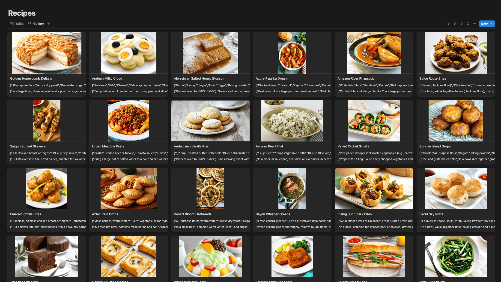
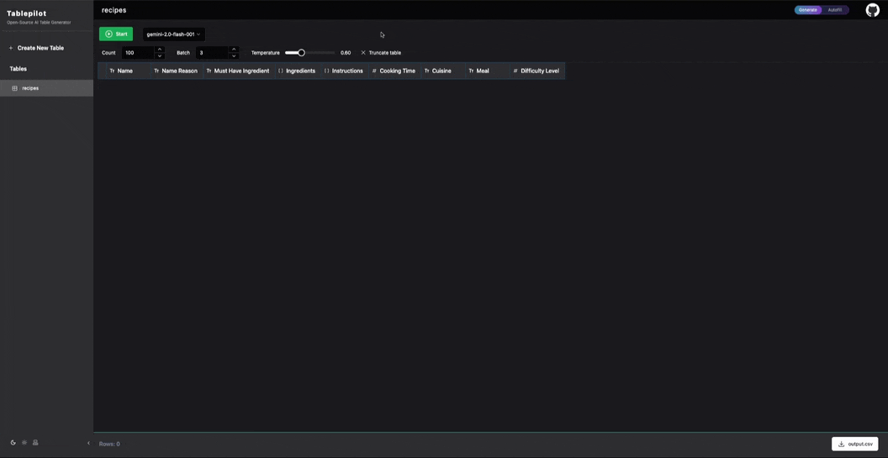
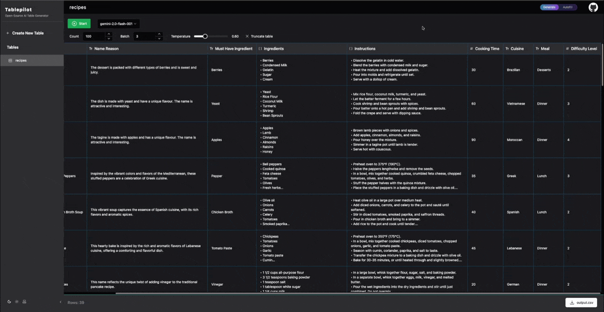
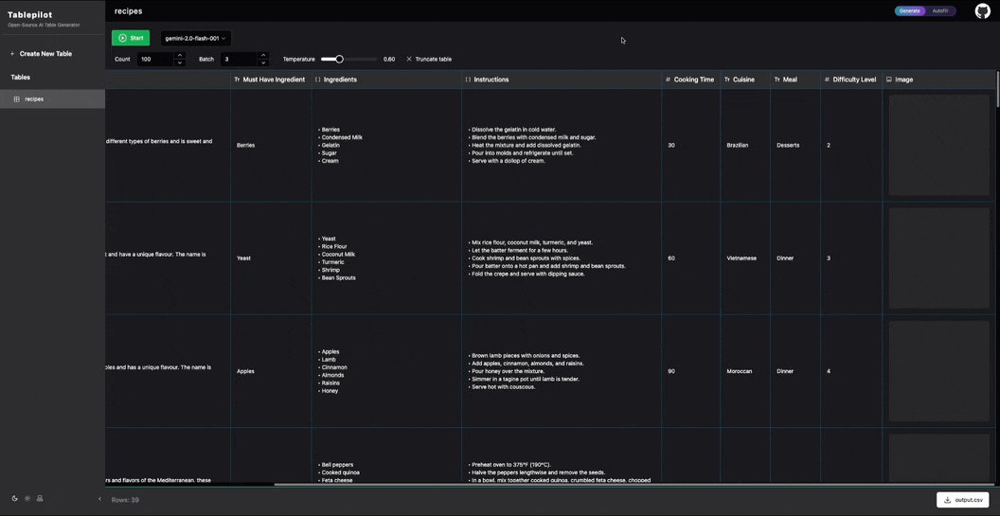

# Generate 100 Recipes with Images Using Tablepilot

This example demonstrates how to generate 100 recipes with random Cuisine, Meal, and Must-Have Ingredients, each assigned an attractive name. Additionally, it generates an image for each recipe.

The example uses `gemini-2.0-flash-001` for text generation and `gemini-2.0-flash-exp-image-generation` for image generation.

You can view the final results in this Notion page: [100 recipes](https://tabulator-ai.notion.site/1df2066c65b580e9ad76dbd12ae7a590?v=1df2066c65b58093bd1a000ccfe702ed), switch between table and gallery views to explore the recipes.

[](https://tabulator-ai.notion.site/1df2066c65b580e9ad76dbd12ae7a590?v=1df2066c65b58093bd1a000ccfe702ed)

Here’s the original CSV file generated: [recipes.csv](./recipes.csv).


## Step 1: Set Up Tablepilot

First, you need to download the release binary or clone and build Tablepilot. For instructions, refer to the [download/install guide](https://github.com/Yiling-J/tablepilot?tab=readme-ov-file#download-binary-release).

## Step 2: Create the Configuration File

Tablepilot uses a TOML configuration file to manage models. Below is an example configuration file used in this tutorial:

```toml
[common]
source_data_dir = "./"

[database]
driver = "sqlite3"
dsn = "data.db?_pragma=foreign_keys(1)"

[server]
address = ":8080"

[[clients]]
name = "gemini"
type = "openai"
key = ""
base_url = "https://generativelanguage.googleapis.com/v1beta/openai/"

[[clients]]
name = "gemini-image"
type = "gemini"
key = ""

[[models]]
model = "gemini-2.0-flash-001"
client = "gemini"
rpm = 10

[[image_models]]
model = "gemini-2.0-flash-exp-image-generation"
client = "gemini-image"
rpm = 10
```

Make sure to replace the `key` with your Gemini key. Both models should be free to use. Save this configuration to a file named `config.toml` in your current working directory.

## Step 3: Create the Table

Start by creating the table in the Tablepilot database (SQLite file `data.db`). After that, you can generate rows for the table using either the CLI or WebUI. Tablepilot uses a JSON file as the table schema to define the structure. I've already included the example schema, which you can use directly if you clone the repository. If you're using the release binary, create a JSON file in your current working directory and copy the example content into it.

```console
tablepilot create examples/100_recipes/recipes.json
```

You can review the [JSON file](./recipes.json) for reference. The important part to note is that the columns for Cuisine, Must Have Ingredient, and Meal are not generated by AI; instead, they are picked from data sources. The combination of these columns adds diversity to the generated recipes.

## Step 4: Generate 100 Recipes (Text)

We will generate the text for the recipes in two steps: one for the text columns and another for the image column. Text generation using `gemini-2.0-flash-001` is fast and stable, so you can generate in batches. You can use either the CLI or WebUI in the following steps, though the WebUI is recommended for a clearer view of the generated content.

CLI:
```console
tablepilot generate recipes -c 100 -b 3
```

WebUI:

Start the web server first:
```console
tablepilot serve
```
You can then access the WebUI at http://127.0.0.1:8080/. Navigate to the table, set the count to 100, the batch size to 3, and click "Start."



## Step 5: Add the Image Column to the Table

Since there is no image column in the schema yet, we need to add one. This can be done using either the CLI or WebUI.

In the CLI, copy the JSON file to a new file, add the image column, and then run the update command:

```console
tablepilot update examples/100_recipes/recipes_with_image.json
```

In the WebUI, simply click on any header cell and add the column via the settings dialog:



## Step 6: Generate Images for Recipes

Now that we have data in the table, we can use autofill mode to populate the missing images for each row.

CLI:
```console
tablepilot autofill recipes --columns=Image --context_columns=Name --context_columns='Name Reason' --context_columns=Ingredients --context_columns=Instructions -c 100 -b 1
```

This command fills the Image column for each row based on the Name, Name Reason, Ingredients, and Instructions columns. The batch size of `1` means that each API call generates one image per row.

WebUI:


### Handling Failed Generations

Since the Gemini flash image model is not very stable, some rows may fail to generate. In such cases, you can reattempt autofill for the failed rows. This feature is only available in the CLI due to the `offset` flag, which allows skipping rows during autofill.

For example, if row 49 failed, you can re-autofill it as follows:

```console
tablepilot autofill recipes --columns=Image --context_columns=Name --context_columns='Name Reason' --context_columns=Ingredients --context_columns=Instructions -c 1 -b 1 -o 48
```

This command skips the first 48 rows and starts autofill from row 49, processing only one row.

## Step 7: Download the Generated CSV File

CLI:
```console
tablepilot export recipes -t=recipes.csv
```

WebUI:
Click the "output.csv" button at the bottom of the table page.

Note: The value in the Image column will be the path to the image.
