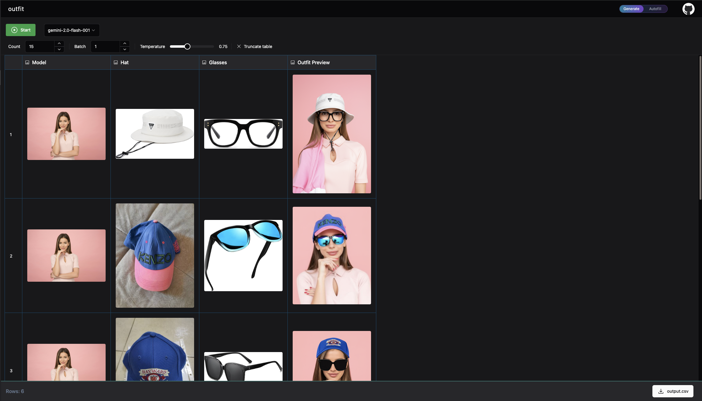

### Create the Table

```bash
tablepilot create examples/outfit_preview.json
```

### Generate Data

```bash
tablepilot generate outfit -c 10 -b 1
```

This command generates 10 rows, one at a time. For each row, it randomly selects a hat image from the `hat` folder and a glasses image from the `glasses` folder.


